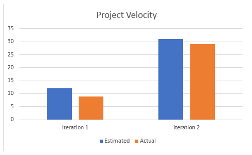

# Cool Sentence Game

## Vision Statement

The **Cool Sentence Game** is a tool intended to improve cognitive skills that may have been impaired by aging or dementia in older adults. It is recommended to be used daily for a better result. The user will be given a sentence or string of words, and after some time elapses, the sentence will disappear. Then the user will have to recreate the sentence. The tool will track a variety of data that the user can reference, including scores, total time played, and average time taken to finish a level of the game. 

### Intended Users

The Cool Sentence Game app will be used by those trying to improve cognitive skills that may have been affected by aging or dementia.

### Major Functionality

The apps main functionality comes in the form of the sentence game.

- Players will have to reconstruct a sentence shortly after seeing it. 

- The players score, as well as time taken, will be stored so that it can be reflected upon later.

- The player will be able to choose multiple difficulties, if they want more of a challenge.

### Team Members

- Christopher

Throughout this project, I learned the importance of communication between team members.

- Deep

Your spunky quote goes here!

- Jordan

Your spunky quote goes here!

- Mehrnaz

Your spunky quote goes here!

- Simon

This project helped me learn how to better structure a codebase

### Sales Pitch

Those suffering from Alzheimer's or dementia may have impaired, or declining cognitive skills. A study conducted by Dr. Zahra Moussavi at the biomedical engineering lab of the University of Manitoba has shown that this game, alongside others, called "Mindtriggers" has been proven to be beneficial for those suffering from Alzheimer's or dementia. Decreasing the rate of cognitive decline. However, that series of games is only available on the iOS System. By designing a similar game on Android, this project would increase the number of potential users, allowing more people to access those benefits. 

## Video

## Postmortem

One problem was keeping track of time. In some cases, the team would work on an issue, but forget to record their hours spent, causing velocity to be skewed. In addition, the changing demands of non-project tasks meant that the team did not have a consistent schedule throughout each iteration, or even between iterations. In iteration 3, however, we began recording things well, as the amount of time each team member had was very limited, so keeping track was a necessity, even outside of the project.

### What went right in the development process.

Our team meshed together very well. In the first days, we had agreed to bring up issues before they could impact the project, and even as the end of the project nears, we still follow that rule. This gives the other team members ample time to address the issue. We spent little time spent arguing over the "correct" way, and instead just worked to find solutions to whatever problems we had. Team members rarely felt that other team members were not pulling their weight. Most felt that they could, and should, contribute more. To us, this means that we worked effectively enough that it was not required team members give 100%, which is a very good thing when the out-of-class responsibilities of team members can mean they are not able to give 100%.

### What would we do differently if we had the chance to start over.

Given the chance to start over, we would frontload our project more. With the knowledge we have now we would be able to achieve much more in the first iteration, which would reduce the stress of the team members during these last weeks. In addition, we would partition the features, user stories, and dev tasks more appropriately. During this, dev tasks were created as more of a stop-gap than an actual planning mesasure. Better usage of development artifacts would be a focus. 

## Velocity Chart

This image is temporary until the times for i3 come in.

As the above chart shows, much of the work was done in the second iteration. The first iteration did not have much done as most of the hours spent on this project are "untrackable". Hours spent figuring out how to set up an emulator on Android Studio, talking to each other to figure out what roles everyone might play, etc, were not tracked on the velocity chart. Those activites made up most of the time in iteration 1. Iteration 2 was the longest iteration, and the team had more free time during it. Additionally, the team meshed together very quickly after the first iteration. Iteration 3 had less accomplished than iteration 2 for the sole reason of being very tight on time. All team members had many other things going on outside of this project, and so not as much time was able to be commited.